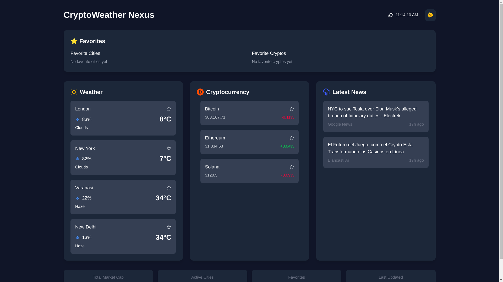
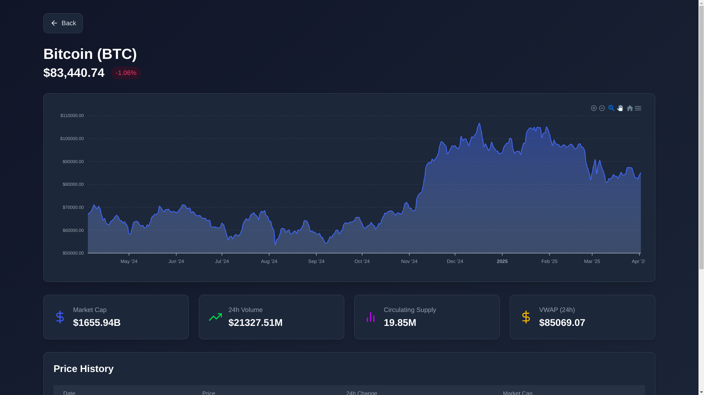
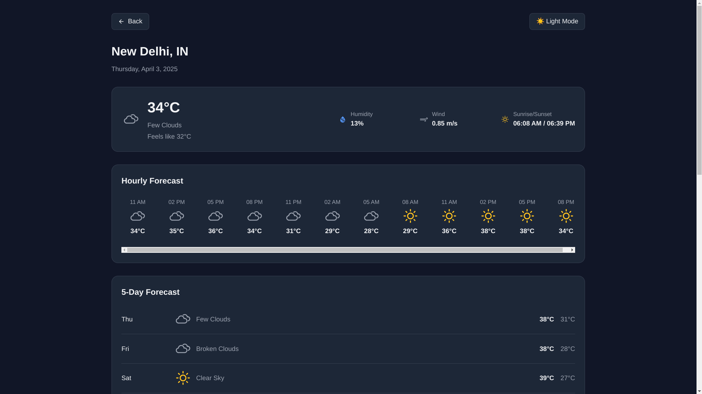

# CryptoWeather Nexus 🌤️💰

 

 

 

A real-time dashboard combining cryptocurrency market data, weather forecasts, and news updates with a beautiful animated interface.

## Features ✨

- **Live Cryptocurrency Prices**: Bitcoin, Ethereum, and Solana with WebSocket updates
- **Global Weather Data**: Current conditions for major cities
- **Personalized News Feed**: Curated news based on your interests
- **Favorites System**: Bookmark your preferred cities and cryptos
- **Dark/Light Mode**: Eye-friendly theme switching
- **Real-time Updates**: Automatic data refresh without page reloads
- **Interactive UI**: Smooth animations and transitions

## APIs Used 📡

| Service       | API Provider | Type       | Note |
|--------------|-------------|------------|------|
| Cryptocurrency | [CoinCap](https://docs.coincap.io/) | WebSocket/REST | **Warning:** This API is known to be inconsistent and may fail frequently. App includes automatic reconnection. |
| Weather       | [OpenWeatherMap](https://openweathermap.org/api) | REST | Free tier available |
| News          | [NewsData.io](https://newsdata.io/docs) | REST | Requires API key |

## Data Fetching Strategy 🔄

### WebSocket (Used for Crypto Prices)
- Establishes persistent connection to CoinCap
- Receives real-time price updates
- Auto-reconnects on failure with exponential backoff
- Fallback to REST API if WebSocket fails

### REST API (Used for Weather & News)
- Initial data load on dashboard open
- Periodic refresh every 60 seconds
- Error boundaries with retry mechanism
- Local cache for offline support

## Technologies 🛠️

**Frontend:**
- Next.js 14 (App Router)
- TypeScript
- Tailwind CSS
- Framer Motion (Animations)
- React Icons
- Axios (HTTP Client)

**State Management:**
- React Context (Theme)
- LocalStorage (Favorites)
- useState/useEffect hooks

## Installation ⚙️

1. Clone the repository:
   ```bash
   git clone https://github.com/yourusername/cryptoweather-nexus.git
   cd cryptoweather-nexus
   ```

2. Install dependencies::
   ```bash
   npm install
    # or
    yarn install
   ```
   
3. Create .env.local file:
   ```bash
    NEXT_PUBLIC_KEY_CRYPTO=your_coincap_api_key
    NEXT_PUBLIC_KEY_WEATHER=your_openweather_api_key
    NEXT_PUBLIC_KEY_NEWS=your_newsdata_api_key
   ```
   
4. Run development server:
   ```bash
     npm run dev
    # or
    yarn dev
   ```
## Known Issues

Known Issues ⚠️

1. CoinCap API Reliability:

    - Frequent disconnections expected

    - May show placeholder data during outages

    - Automatic reconnection attempts every 5 seconds

2. Rate Limiting:

    - NewsData.io has strict rate limits

    - OpenWeatherMap free tier has hourly limits